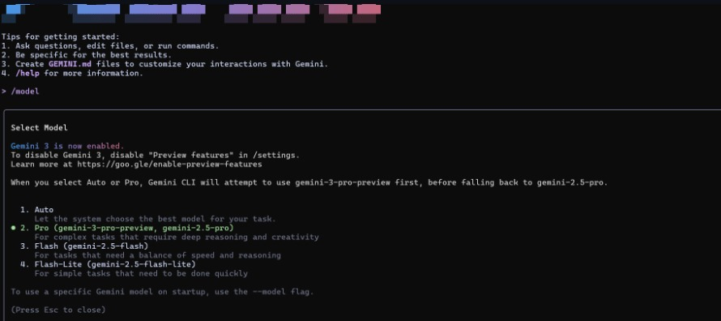

# 🚀 AI-Driven Development  30 Day Challenge  
## **Task 3**

---

# 🌟 PART A  Research Questions (Short Answers)

### **1. What new improvements were introduced in Gemini 3.0?**  
Gemini 3.0 includes faster reasoning, a much longer context window, improved safety, and state-of-the-art multimodal performance across text, images, and video.

---

### **2. How does Gemini 3.0 improve coding & automation workflows?**  
It enhances coding with Gemini CLI, supports multi-file project generation, improves bug fixing, and automates long tasks like workflows, scripts, and code execution.

---

### **3. How does Gemini 3.0 improve multimodal understanding?**  
It provides stronger understanding across images, text, documents, and video  including tables, layouts, screenshots, and complex visual structures.

---

### **4. Name any two developer tools introduced with Gemini 3.0.**  
1. **Gemini CLI 3.0**  
2. **Google Antigravity / Gemini Code Assist**

---

# 🌟 PART B  Practical Task (Gemini CLI 3.0 Installation)

 

---
