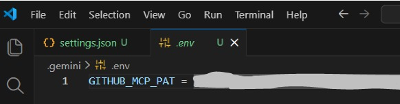
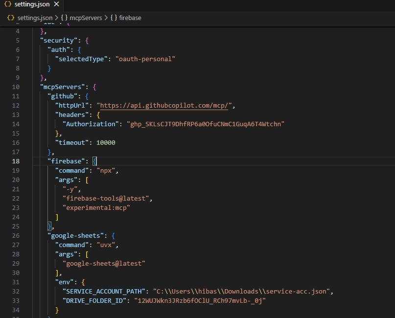
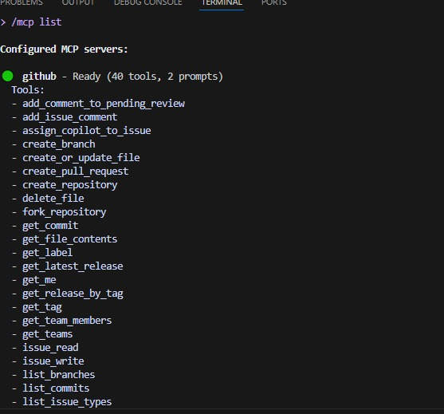
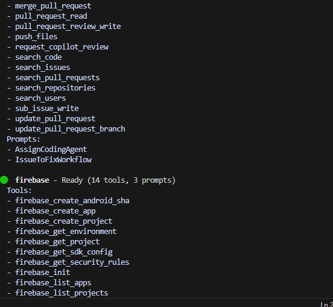
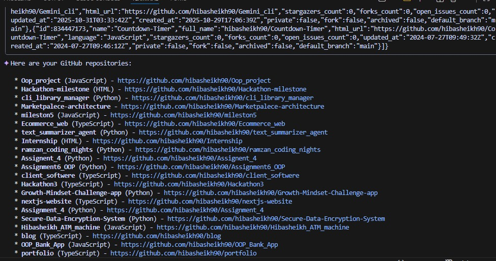

# AIDD 30 Day Challenge  Task 6

Repository for Task 6 of the AIDD 30-Day Challenge.

---

##  .env file 

---

##  settings.json

---

##  /mcp list result

---

##  GitHub repo list output

---

##  Task Summary

This task connects **Google Gemini CLI** with the **GitHub MCP Hosted Server**.

After successful setup:
- Gemini can list your GitHub repositories  
- Interact with GitHub  
- Use MCP tools (90+ tools)  
- Automatically load GitHub token securely from `.env`  
- No Docker or MCP installation required  

